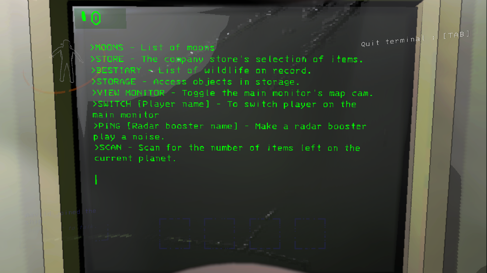

# NewTerminal

Allows customising every single displayText on the terminal

warning: contains spoilers for creatures and log-messages


## Usage

Download and follow the guide for [BepInEx 5.4.22](https://github.com/BepInEx/BepInEx).

Download [Release/BepInEx/plugins/NewTerminal.dll](https://github.com/Aavild/NewTerminal/tree/master/Release/BepInEx/plugins) and put it into `\Lethal Company\BepInEx\plugins`.

Run LethalCompany and enter the spaceship once to generate the config files.

Modify the config file in `\Lethal Company\BepInEx\config`.

Example of an entry in a category:

```
[TerminalMenus.Other] # <--- this is a category

# Setting type: String
# Default value: >MOONS\nTo see the list of moons the autopilot can route to.\n\n>STORE\nTo see the company store\'s selection of useful items.\n\n>BESTIARY\nTo see the list of wildlife on record.\n\n>STORAGE\nTo access objects placed into storage.\n\n>OTHER\nTo see the list of other commands\n\n[numberOfItemsOnRoute]\n
Help = >MOONS\nTo see the list of moons the autopilot can route to.\n\n>STORE\nTo see the company store\'s selection of useful items.\n\n>BESTIARY\nTo see the list of wildlife on record.\n\n>STORAGE\nTo access objects placed into storage.\n\n>OTHER\nTo see the list of other commands\n\n[numberOfItemsOnRoute]\n
```
can be modified into the following:
```
[TerminalMenus.Other]

# Setting type: String
# Default value: >MOONS\nTo see the list of moons the autopilot can route to.\n\n>STORE\nTo see the company store\'s selection of useful items.\n\n>BESTIARY\nTo see the list of wildlife on record.\n\n>STORAGE\nTo access objects placed into storage.\n\n>OTHER\nTo see the list of other commands\n\n[numberOfItemsOnRoute]\n
Help = >MOONS - List of moons\n>STORE - The company store\'s selection of items.\n>BESTIARY - List of wildlife on record.\n>STORAGE - Access objects in storage.\n>VIEW MONITOR - Toggle the main monitor\'s map cam.\n>SWITCH [Player name] - To switch player on the main monitor\n>PING [Radar booster name] - Make a radar booster play a noise.\n>SCAN - Scan for the number of items left on the current planet.\n\n
```

## Tips

`#` are comments. Feel free to add/remove them as you see fit, although BepInEx might also create the default comments and remove new comments.

`\n` are newlines. You can temporarily make newlines for each `\n` and then delete the newlines when you're done editing an entry.

`[totalCost]` is an example where the game replaces a part of the text with a value.

The `\n\n` at the end of the text is to place the cursor at a new line. These are nice to have but not required.

Some letters need to be escaped by putting a `\ ` before them such as `\'`.

if a value stops working just delete the entire entry. The plugin will automatically add it back the next time you enter a ship.

Each line is exactly 51 letters long.

In Notepad++ you can collapse categories to make navigation easier.

if you have other useful tips for other players feel free to create a Github issue on it.

## Dev

Note that lib is left empty on purpose as the game DLLs are considered intellectual property.

Please find the needed DLLs on your own in your LethalCompany folder at `\Lethal Company\Lethal Company_Data\Managed` and insert them in the lib folder.

Then either run `dotnet build` -> dll produced in Release folder.

or `dotnet build -p:BuildInPlugin=true` -> dll produced in Lethal Company folder.